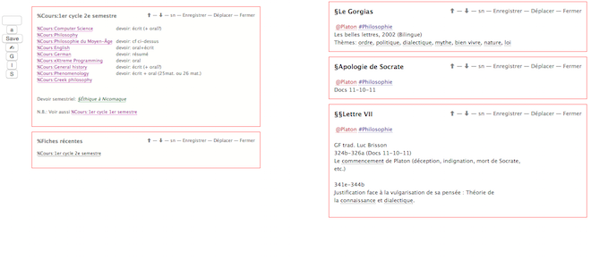
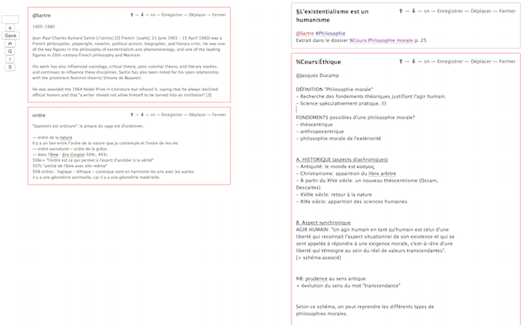
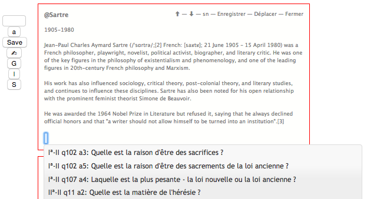
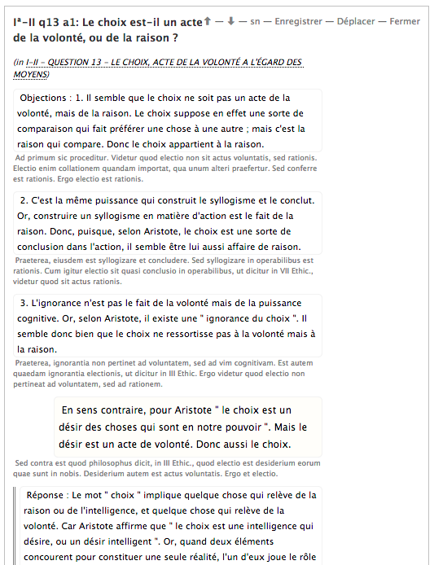

# PMWiki

A simple personal wiki, designed for students in the humanities. 

## Technology

This one-page event-driven web application is build in Backbone/Coffeescript, on top of a light-weigh Rails server. It has been designed to be used offline, and provides a synchronization between the browser local storage and the server.

## History of the project

As a student of philosophy, I needed a tool to improve my note-taking during classes. The purpose was displaying on a single screen not only the document being edited, but also contextal information, such as biographies, definitions, other texts being studied, etc.

The solution was organizing each of these data in small entities called _tiles_.
The difference with a traditional wiki is that instead of going from page to page (or instead of switching from one tab to another), all the _tiles_ are display on a single page, and the view can be organized such as displaying only the useful contents.

Technically, there is one unique kind of documents — be they short (definitions, biographies, indexes, reviews) or long (texts, notes, etc.)

The difference between them can be explicited by a prefix (this is convention):

- `%` for documents edited by the user
- `§` for long texts
- `§§` for short texts
- `@` for authors (and their biography)
- `^` for theological contents
- `Iª` for articles of the _Summa Theologiae_
- _nothing_ for definitions or philosophical concepts

These conventions make it easier to browse the content of this personal library.

## Features

Let's first have a look on the main screen.

The contents are displayed on too columns. On the left: these tiles are loaded when the application starts.

- The first tile is an index of the classes followed by the student. In other words, it is a list of links to other tiles —one tile per class.
- The second one shows a list of the recently modified _tiles_.

The right column shows the tiles being edited. Various tiles can be edited at the same time. Tiles can be short or long, as shown on this other screenshot:

There are many convenient ways to navigate within the contents:

- just scolling (vertically)
- clicking on the links within the documents: the target tile will be added on top of the stack
- through a search field on the top-left of the page (to load other tiles)
- using the browser page search (`ctrl + F`)
- using the arrows (top of each tile) to access to a more recent tile, or an older one.

While editing a document, if the user hits one of the key `%`, `§` or `@`, it will display an autocompletion field, making it easier to create links between tiles.

My database contains the whole Summa Theologiae, in two languages, with a special formatting. I can send this database to those who already own a license for the French translation. Just ask me!

## Warning

To test the application, a database with a minimum of content is needed. Please ask me if you need a sample of my own database.

## Next features

- Make a standalone javacscript app, connecting it directely to couchDB instead of a rails app
- Turn this application into a multi-user product.
- Translate the app into english
- Enable the user to define his own conventions for naming the tiles
- Make it easier to import existing contents
- Show more contextual information through APIs
- Improve offline mode

## license

MIT